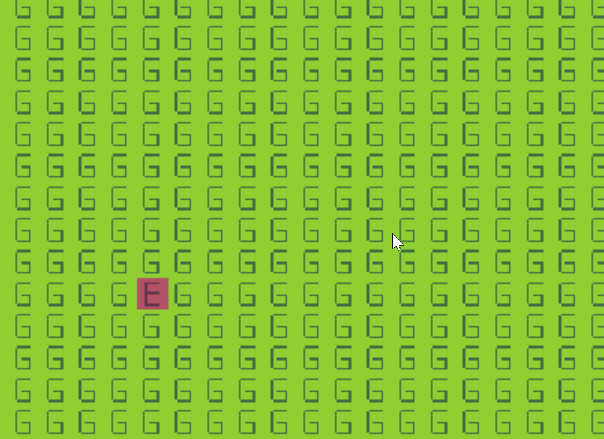
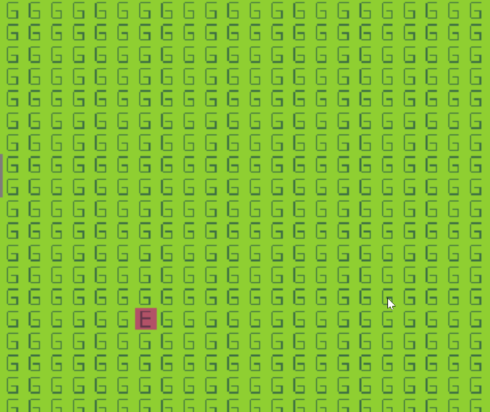
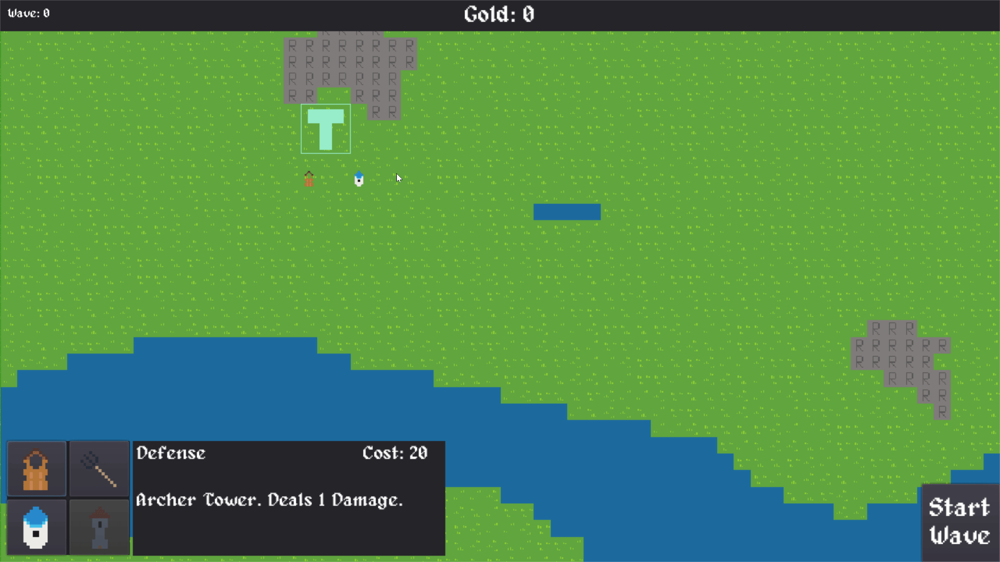

# Keep Defense - Behind the Scenes

## Documents in PDF
- [Game Pitch](./docs/Game-3-Pitch.pdf)
- [Paper prototype of game mechanic](./docs/Game-3-Paper-Prototype.pdf)
- [Playtesting Script](./docs/Playtest-Script.pdf)

## GIFs
Enemy destroys the tower. 

Enemy pathfinds toward the tower. 

Tower ranges shown in build mode and while hovering over a tower. 
